## CTFlearn/RE

## RE_verseDIS

### Đề bài

https://ctflearn.com/challenge/188

### Lời giải

- Tải file thực thi về và chạy thử, chương trình không cần tham số đầu vào mà phải nhập trong lúc chạy. Không thấy có gì đặc biệt.

  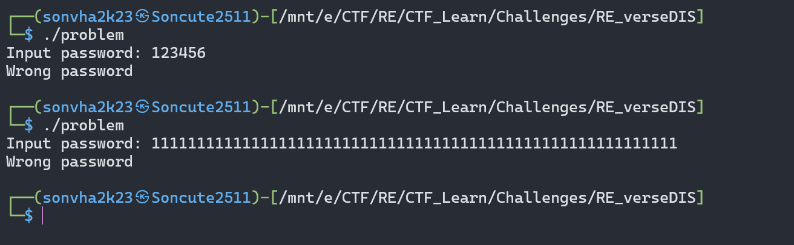

- Đưa vào `IDA` và `GDB` phân tích, qua một lần chạy thử với `GDB` để quan sát luồng của chương trình, khá bất ngờ khi `flag` được gen ra trước khi so sánh với input, có vẻ là một bài cho điểm :v. Tất nhiên ta sẽ không dừng lại ở đây mà phân tích, viết lại chương trình với mục đích học tập chứ không chỉ là spam lệnh `ni` để lấy flag.

  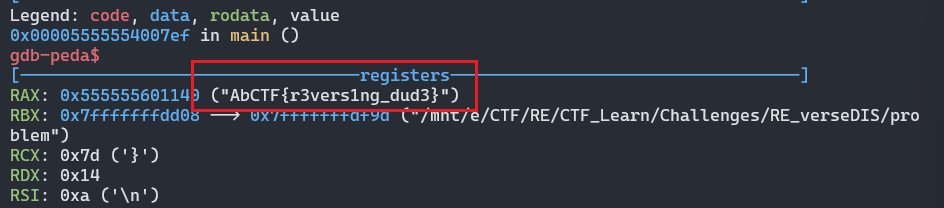

- Qua quan sát trên `IDA` với graph view cùng 1 lần chạy chương trình với `GDB` trước đó, có thể thấy khối lệnh này có chức năng gen flag.

  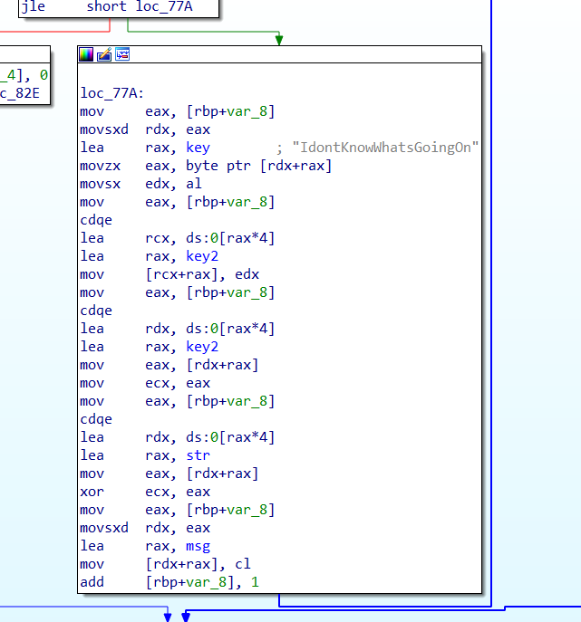

- Khối lệnh này không có điều kiện gì để nhảy vào liên quan tới input của chúng ta, nó sẽ lặp 21 lần, tương ứng với độ dài của flag.

  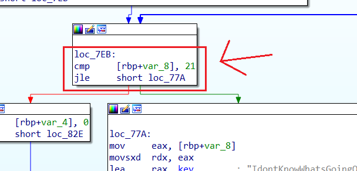

- Điều tiếp theo cần chú ý đến là sự xuất hiện của một vài biến được gán vào các thanh ghi mình chỉ vào dưới đây.

  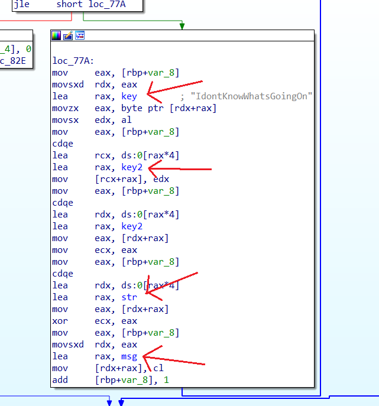

- Biến `key` đã mang sẵn giá trị là chuỗi <b>"IdontKnowWhatsGoingOn"</b> khả năng cao được dùng gen ra flag bởi có cùng độ dài là 21.
- Sau khi gán giá trị từ biến `key` vào thanh ghi `EAX`. Lệnh `movzx EAX, byte ptr [RDX+RAX]` với `RDX` được gán giá trị của `[rbp+var_8]`-biến lặp của khối lệnh trước đó, Thanh ghi `EAX` giờ sẽ mang giá trị tại địa chỉ `RAX[RDX]`, tức vị trí tương ứng của chuỗi <b>"IdontKnowWhatsGoingOn"</b> với lần lặp của khối lệnh. Thực hiện gán giá trị hiện tại nằm trong `EAX` vào `EDX`, cuối cùng là truyền giá trị của biến lặp vào thanh ghi `EAX` thông qua câu lệnh mov `EAX, [rbp+var_8]`. Để cho dễ hình dung, cho tới dòng mà mình gạch chân thì đây là các giá trị trong `EAX`, `EDX`.

  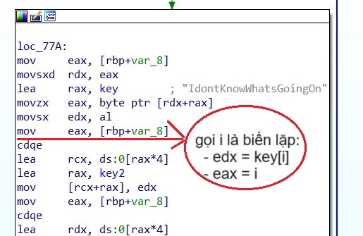

- Tiếp theo, lệnh `lea RCX, ds:0[RAX*4]` gán giá trị của `RAX` gấp 4 lần vào `RCX`, rồi truyền địa chỉ của biến `key2` vào `RAX`. Thử lấy giá trị từ đây xem có thông tin gì không, kết quả trả ra khẳng định mảng `key2` là mảng rỗng.

  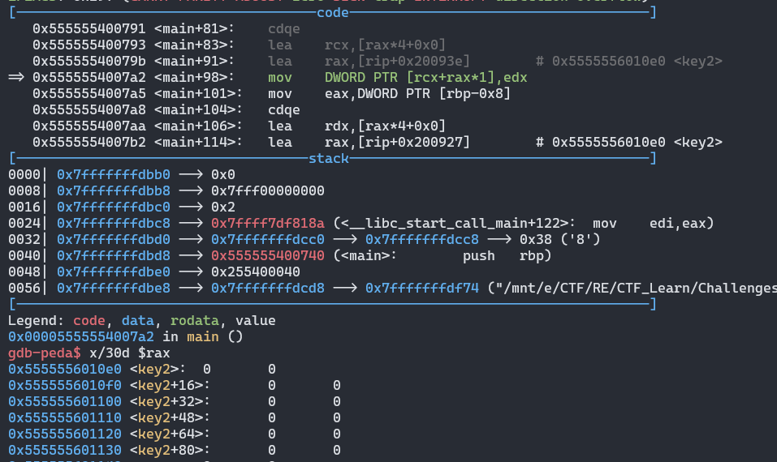

- Truyền giá trị ở `EDX` vào key2[RCX] với lệnh `mov [RCX+RAX], EDX`. Một loạt các câu lệnh sau thực hiện thao tác gán giá trị ở `key2[rbp+var8]` vào ECX, sẽ dùng để thực hiện phép `xor` sau đó.

  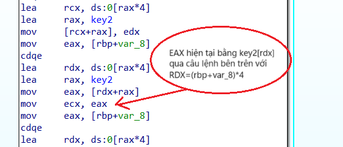

- Xuất hiện mảng `str`, gán giá trị của `str`ở vị trí bằng `[rbp+var_8]*4` vào `EAX`. Ta thử trích ra giá trị của `str` xem sao.
  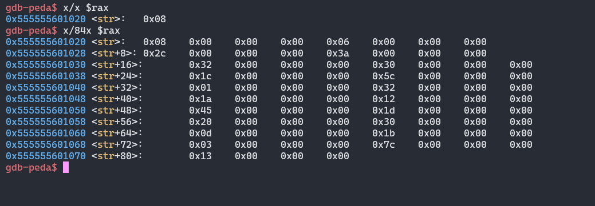
- Mục đích chương trình có vẻ đã sáng tỏ, các biến của hàm `str` được in cách biệt 4 đơn vị, có vẻ đây là lý do vì sao các giá trị nằm trong `key` được truyền vào `key2` với khoảng cách tương tự mảng `str`. Các dòng lệnh còn lại thực hiện `xor` các giá trị tương ứng của 2 mảng `key2` và `str` rồi lưu vào mảng `msg`.

  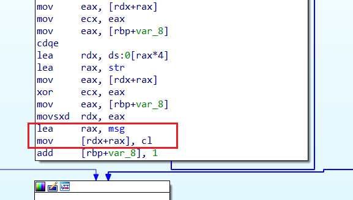

- Ta viết script khai thác được dịch từ khối lệnh gen flag vừa phân tích trên:

```python
# flag_comp = 'abcdefghijklmnopqrstuvwxyzABCDEFGHIJKLMNOPQRSTUVWXYZ0123456789!@#$%^&*()_+-=<>,.?/{}[]\|~'
key = "IdontKnowWhatsGoingOn"
str = [0x08, 0x00, 0x00, 0x00, 0x06, 0x00, 0x00, 0x00, 0x2c, 0x00, 0x00, 0x00, 0x3a, 0x00, 0x00, 0x00, 0x32, 0x00, 0x00, 0x00, 0x30, 0x00, 0x00, 0x00, 0x1c, 0x00, 0x00, 0x00, 0x5c, 0x00, 0x00, 0x00, 0x01, 0x00, 0x00, 0x00, 0x32, 0x00, 0x00, 0x00, 0x1a, 0x00, 0x00, 0x00, 0x12, 0x00, 0x00, 0x00,
       0x45, 0x00, 0x00, 0x00, 0x1d, 0x00, 0x00, 0x00, 0x20, 0x00, 0x00, 0x00, 0x30, 0x00, 0x00, 0x00, 0x0d, 0x00, 0x00, 0x00, 0x1b, 0x00, 0x00, 0x00, 0x03, 0x00, 0x00, 0x00, 0x7c, 0x00, 0x00, 0x00, 0x13, 0x00, 0x00, 0x00, 0x00, 0x00, 0x00, 0x00, 0x00, 0x00, 0x00, 0x00, 0x00, 0x00, 0x00, 0x00]
flag = ""

for i in range(21):
    flag += chr(ord(key[i]) ^ str[i*4])

print(flag)

```

Thực thi chương trình, ta thu được flag

```
flag: AbCTF{r3vers1ng_dud3}
```

- Tất nhiên Challenge này sẽ dễ dàng hơn khi đọc mã giả C với chức năng `f5` của `IDA`. Nhưng mục tiêu của mình khi viết write-up này là hỗ trợ người đọc trong việc phân tích mã máy nên sẽ không sử dụng nó :v.
  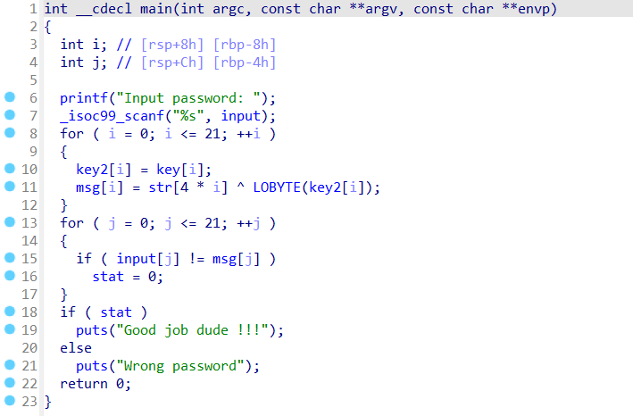

## Mong WRITEUP này giúp ích cho các bạn :v

```
from KMA
Author: 13r_ə_Rɪst
```
