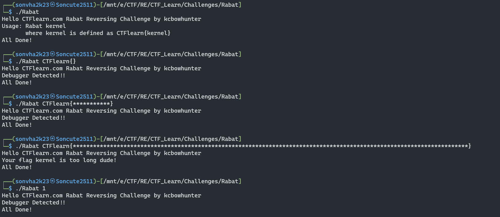
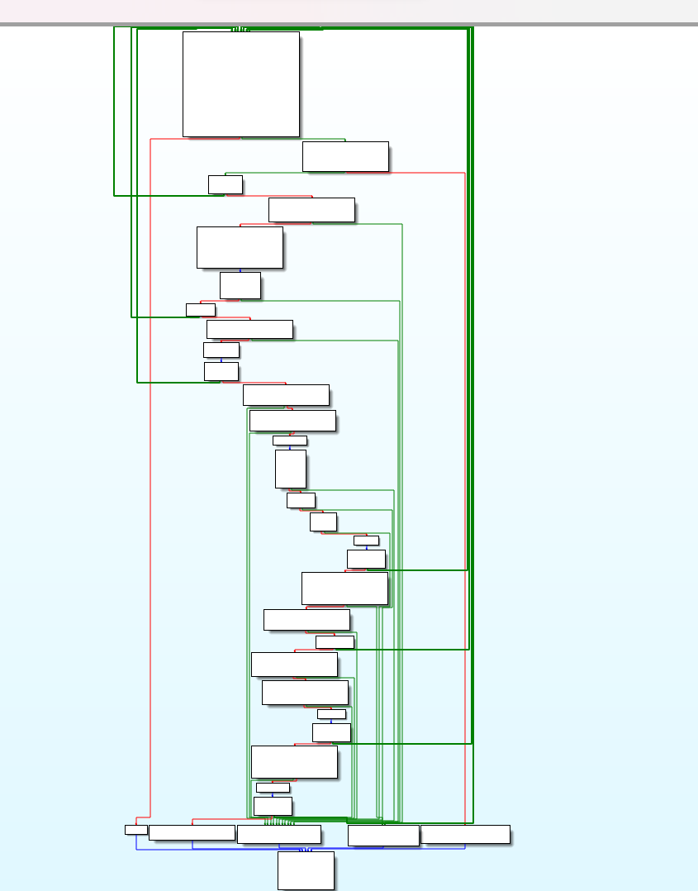
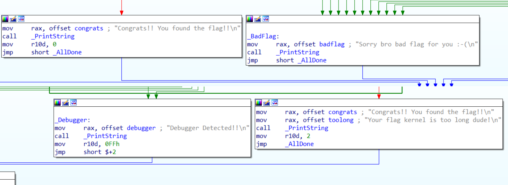
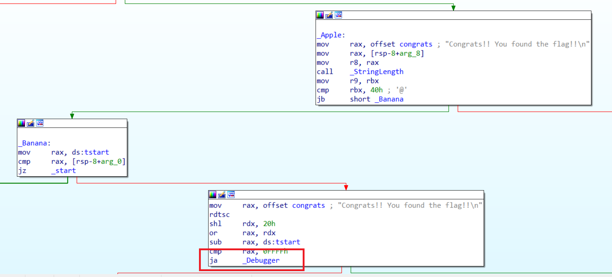
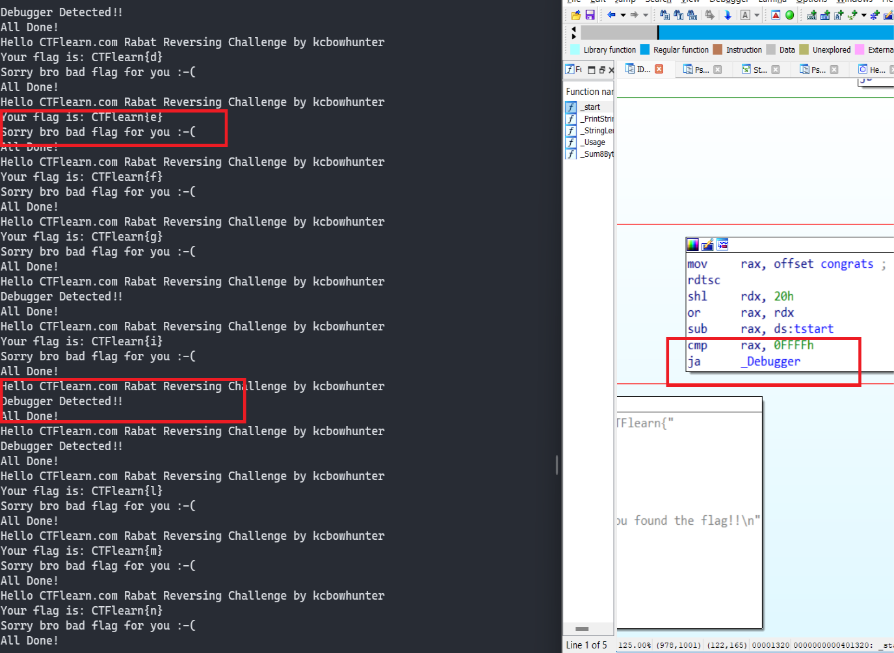
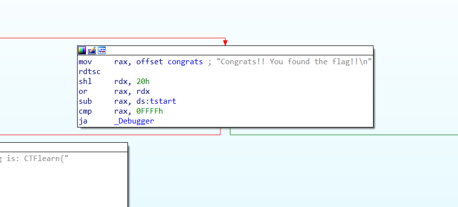
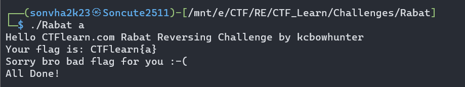
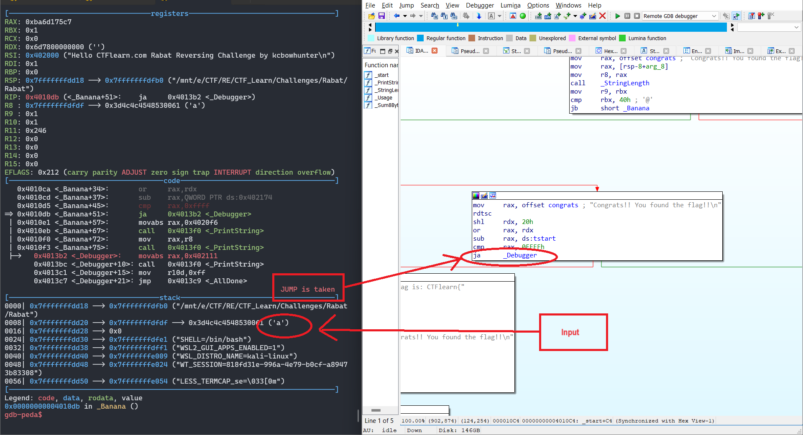
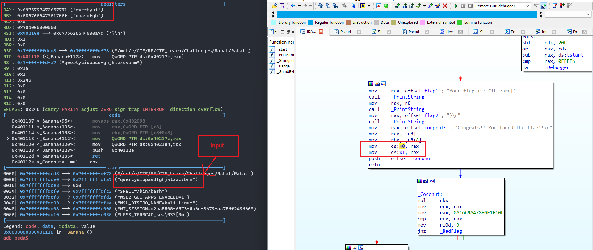

## CTFlearn/RE

## RE_verseDIS

### Đề bài

https://ctflearn.com/challenge/188

### Lời giải

- Thực thi chương trình với một số default input xem có manh mối nào không. Kết quả trả ra lại là **"Debugger Detected!!"** mà không phải thông báo đúng/sai và đầu vào sẽ không bao gồm cụm `CTFlearn{}` mà chỉ có nội dung của flag. Thông tin không quá hữu ích :v.

  

- Sử dụng `IDA` và `GDB` để xem luồng chương trình, qua quan sát ở `graph view` thứ đập vào mắt mình khá đáng sợ :v

  

- Với một chương trình có lượng block lớn và luồng phức tạp như này. Điều đầu tiên mình nghĩ là phân tích ngược từ dưới lên nếu có thông báo Success!, Congrats! hay đại loại vậy đề nhặt ra hướng đi đúng của chương trình thay vì đọc từ trên xuống như thường lệ.

  

- Đây là 4 thông báo đầu ra của chương trình, qua các phép thử của mình trước đó. Chương trình luôn trả về 2 câu lệnh dưới, gồm **"Debugger Detected!!"** và **"Your flag kernel is too long dude!\n"**.

- Output cảnh báo về độ dài đã rõ ràng, ta tìm hiểu vì sao lại là **"Debugger Detected!!"** mà không phải thông báo `true/false` bên trên. Có 2 hướng đi tới khối lệnh này, kiểm tra thử.

  

- Một trong hai hướng đó chỉ tới block kiểm tra đầu tiên của chương trình. Điều đó nghĩa nếu kí tự/chuỗi đầu tiên của Input mà không chính xác sẽ nhảy tới khối lệnh kia.

- Để kiểm chứng, ta viết một script chạy chương trình liên tục với đầu vào gồm 1 kí tự, nếu kí tự đó là chính xác, output sẽ trả về false chứ không phải **"Debugger Detected!!"**.

  

- Đã xuất hiện cả 2 trường hợp lẫn lộn, dù sao lệnh kiểm tra cũng là `ja` chứ không phải `jne` nên không thể có kết quả chính xác. Đó là một chút phân tích bề ngoài. Ta sử dụng gdb để thao tác và theo dõi trực tiếp chương trình ra sao.

- Vấn đề đầu tiên xuất hiện ở hàm kiểm tra này:
  

- Như tình huống vét cạn một kí tự ở trên, ta đã đoán rằng giá trị trả về của hàm này liên quan tới Input. Nhưng dưới phép thử sau đây lại chứng minh rằng điều đó không chính xác. Ta lấy một trường hợp bất kì trả về False và chạy trên `GDB`, ở đây input là **'a'**:
  
- Không giống dự đoán, khi thực hiện kiểm tra bằng `GDB` chương trình vẫn nhảy tới khối lệnh in ra thông báo **"Debugger Detected!!"**.

  

- Dường như câu lệnh kiểm tra này mình cần phải bypass khi thực hiện debug, bằng chứng là 2 output khác nhau như trên. Đồng thời mình đưa ra nhận định rằng khối lệnh kiểm tra này thậm chí không phụ thuộc vào input bởi khi nhập cùng một input, giá trị nằm trong thanh ghi `EAX` của câu lệnh kiểm tra `cmp rax, 0x0FFFF` là khác nhau. Còn về việc khối lệnh này dựa vào yếu tố nào để check debugger, mình đoán đó là thời gian vì chương trình có sự xuất hiện của lệnh `rdtsc`.

- Sửa giá trị thanh ghi `EAX` để bypass hàm kiểm tra. Nhảy tới khối lệnh tiếp theo, sau khi in ra giá trị của flag và các thông báo gây nhiễu, khối lệnh thực hiện thao tác lấy ra 8 giá trị đầu và 8 giá trị sau đó Từ input và gán vào 2 biến `x0`, `x1`.

  

- Khi nào rảnh mình sẽ viết nốt :v

```
flag:
```

## Mong WRITEUP này giúp ích cho các bạn :v

```
from KMA
Author: 13r_ə_Rɪst
```
