## CTFlearn/RE

## Rio32

### Đề bài

https://ctflearn.com/challenge/download/1015

### Lời giải

- Tải file về và chạy thử, `input` bài này có vẻ khá lạ
  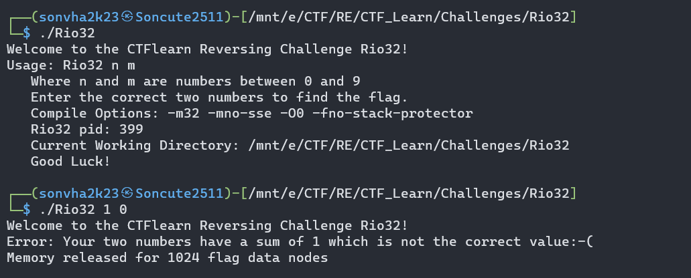
- Với `input` đơn giản như này, trước khi phân tích ta thử vét cạn xem sao.

```bash script
#!/bin/bash
for i in {0..9}
do
    for j in {0..9}
    do
        ./Rio32 "$i $j"
    done
done
```

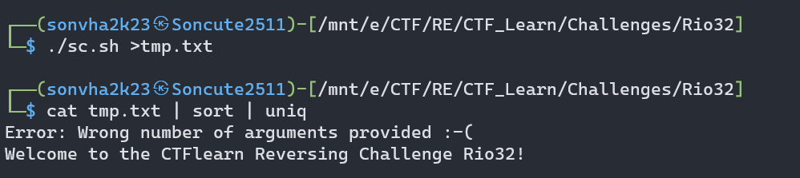

- Kết quả cũng không bất ngờ lắm, dù sao cũng là bài có độ khó medium :v
- Dù sao cũng là một manh mối, mình đoán rằng để lấy được flag thì cần set lại giá trị thanh ghi ở các câu lệnh kiểm tra. Dùng `IDA` và `GDB` để xem luồng chương trình ra sao.

- Có lẽ dự đoán ban đầu là chính xác, Nếu mình nhập đúng 2 số nguyên 1 digit như yêu cầu, chương trình luôn trả về block sau:

  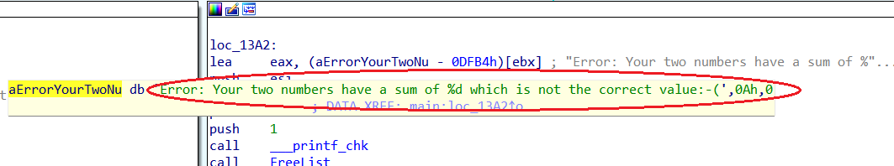

- Vấn đề ở đây là, nếu ta nhập đúng format đầu vào, thì khối lệnh đó sẽ luôn được nhảy đến, bởi lệnh kiểm tra là so sánh tổng của `input` với `0x14` tương đương với `20` ở hệ thập phân, hay lệnh kiểm tra sau đó là `cmp EAX, 0x64` với giá trị của `EAX` bằng tích của 2 giá trị đầu vào với câu lệnh `mul EAX, ECX` trước.

  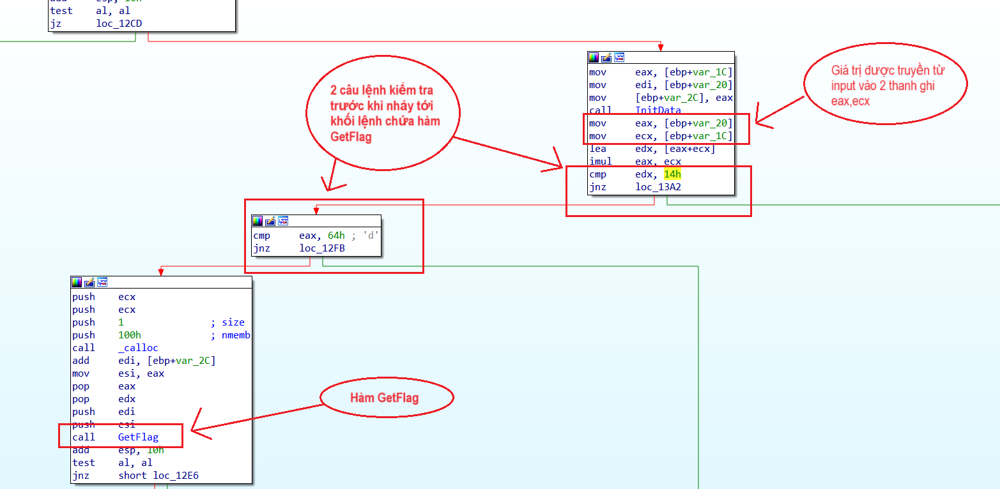

- 2 phép toán kiểm tra cho ta một bài toán nho nhỏ. Tính 2 giá trị 2 số `a` và `b` với điều kiện:

```
a + b = 0x14
a * b = 0x64
```

- Giải hệ phương trình, ta có kết quả: `a = b = 10 = 0xa` là nghiệm duy nhất của hệ.
- Rõ rồi chứ :v. Đó là lệnh kiểm tra luôn trả về `false` bởi bộ tổng lớn nhất của 2 chữ số 1 digit là `9 + 9 = 18`, hay với tích là `9 * 9 = 81`. Với thông tin này, ta có 2 hướng đi:

1. Nhập giá trị đầu vào thỏa mãn 2 phép toán và thực hiện patching ở hàm kiểm tra đầu vào.
2. Sửa giá trị của `input` tại địa chỉ gốc sau hàm kiểm tra format đầu vào để bypass 2 câu lệnh kiểm tra.

- Quan trọng hơn, hàm **GetFlag** có đối số đầu vào là 2 số nguyên, mình đoán đó là 2 giá trị từ `input`. Nếu là vậy, việc patching cũng cần tính toán nếu giá trị đầu vào có thể ảnh hưởng tới kết quả trả về của hàm **GetFlag**. Trước tiên ta thử một vài giá trị đầu vào đúng với format để xác minh nhận định trên.

- Bắt đầu với hướng đi thứ nhất, với `Input` là 10 10, ta gặp chướng ngại đầu tiên ở hàm `GetArgs` là lệnh kiểm tra độ dài.

  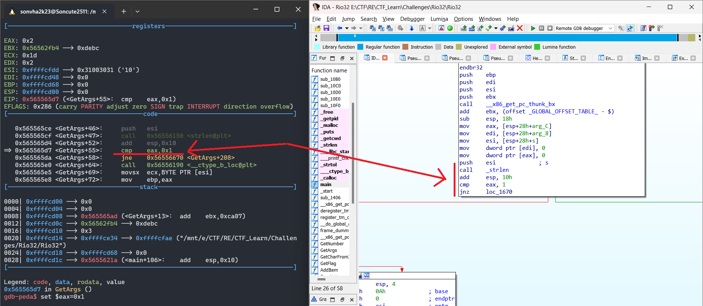

- Để bypass, ta set giá trị ở thanh eax thành 0x1 trước lệnh dòng lệnh thực hiện nhảy.

```
set $eax=0x1
```

- Tiếp đó là lệnh kiểm tra như hình dưới. Lệnh kiểm tra này nếu trả về `true`, chương trình sẽ tiến tới Block chứa thông báo **"Error: Argument %s is not a digit\n"**. Vậy ta cần sửa giá trị ra sao để câu lệnh trả về `false`.
- Lệnh kiểm tra là `test BYTE PTR [eax+ecx*2+1], 8` ta in ra giá trị tại **địa chỉ** có giá trị được tính bằng [eax+ecx*2+1] = 0xf7f25380 * 0x31*2 + 0x1 = 0xF7F253E3. Giá trị ở đây lại khác bằng 0x08d808d8, vượt xa giá trị cần so sánh là 0x8. Có thể do lần patching trước đó để bypass câu lệnh kiểm tra độ dài khiến việc kiểm tra giá trị của Input là số 10 = 0xa lại ngẫu nhiên được bypass theo mà không cần sửa gì thêm. :v

  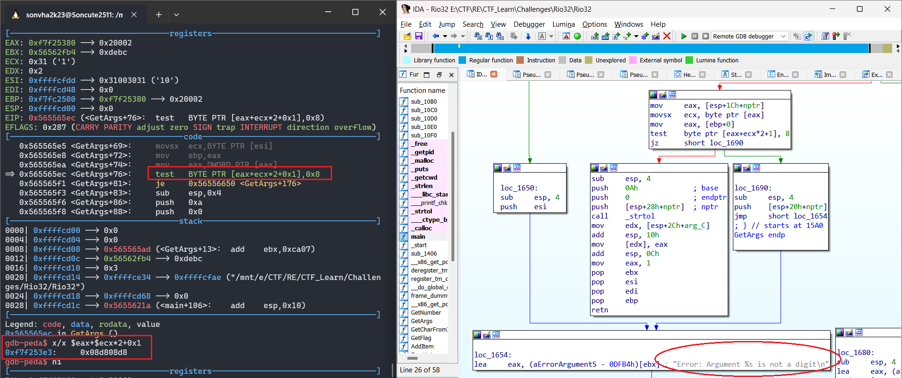

- Thực hiện tương tự với phép kiểm tra giá trị Input thứ 2. Sau khi hoàn thành hàm kiểm tra Input, với 2 giá trị đầu vào là 10 10, ta hoàn toàn có thể thực hiện nhảy qua 2 hàm kiểm tra nhắc ban đầu mà không cần sửa đổi gì thêm. Spam lệnh `ni` qua hàm `GetFlag`, ta nhận được chuỗi đầu ra của hàm là:

  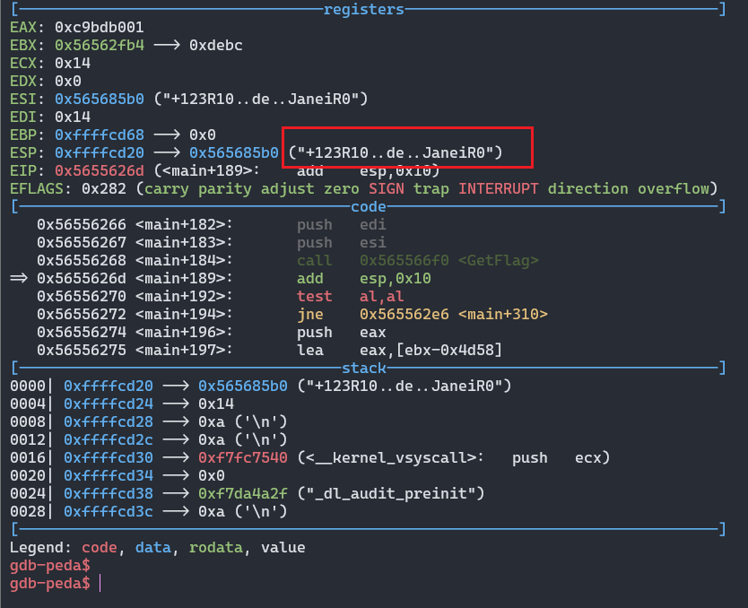

```
flag: CTFlearn{+123R10..de..JaneiR0}
```

- Dù đã hoàn thành mục đích, mình vẫn muốn hướng dẫn mọi người hướng tiếp cận thứ 2 bởi đó là hướng đi của mình trong lần đầu tiên lấy được flag(sau 2 ngày choke lòi kèn :-() ).

- Bắt đầu, ta nhập input tùy ý đúng format để không cần quan tâm hàm kiểm tra Input `GetArgs`.

  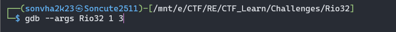

- Tới vị trí này, ta thấy giá trị tương ứng với Input mình đã nhập, ở đây là 1 và 3.

  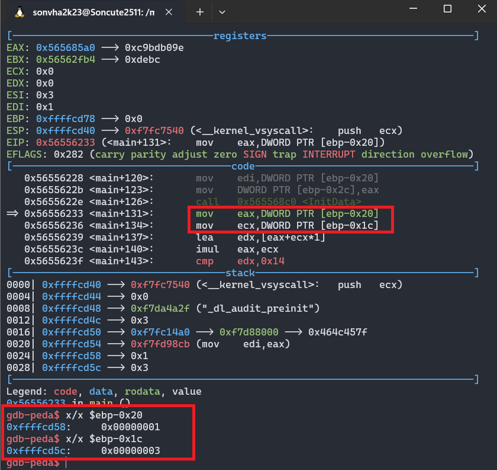

- Mục tiêu đã ở trước mắt, nhưng sửa bằng cách nào? vì thứ được truyền vào EAX chỉ là giá trị chứ không phải địa chỉ, vậy nên mọi cách sửa dưới đây là vô dụng:

  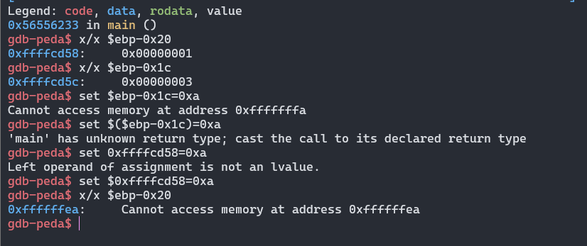

- Thông tin duy nhất ta có về input là địa chỉ của nó. Sau khi tìm hiểu, mình cũng có một số thu hoạch nhất định. Để thay đổi giá trị tại một địa chỉ trong `GDB`, bạn có thể sử dụng lệnh `set` với cú pháp `set {TYPE} ADDRESS = VALUE`, cụ thể trong tình huống này ta làm như sau:

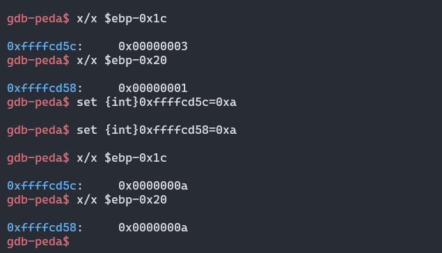

- Sau khi thay đổi giá trị, thực hiện lệnh `ni` và gặt flag như hướng đi 1.
- Dù viết WU mượt như này, trong quá trình làm Chall này có vẻ mindset của mình không được tốt nên đã có hướng đi khá sai lầm khi test hết mọi trường hợp input như dưới đây để tìm manh mối :))).
  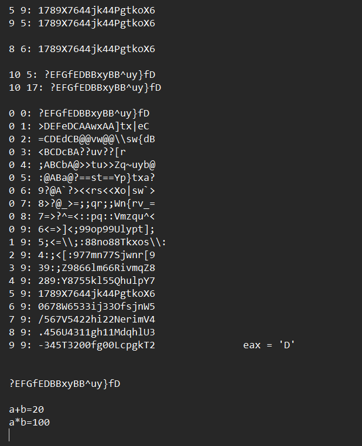
- Mình viết WU này sau 1 ngày bất lực với chall rồi quyết định tiếp cận lại bài toán một cách cẩn thận. Mong lời giải này giúp các bạn không tuyệt vọng như mình bởi tìm không ra Writeup mà phải tự giải quyết :))).

## Mong WRITEUP này giúp ích cho các bạn!

```
from KMA
Author: 13r_ə_Rɪst
Email: sonvha2k23@cvp.vn
```
