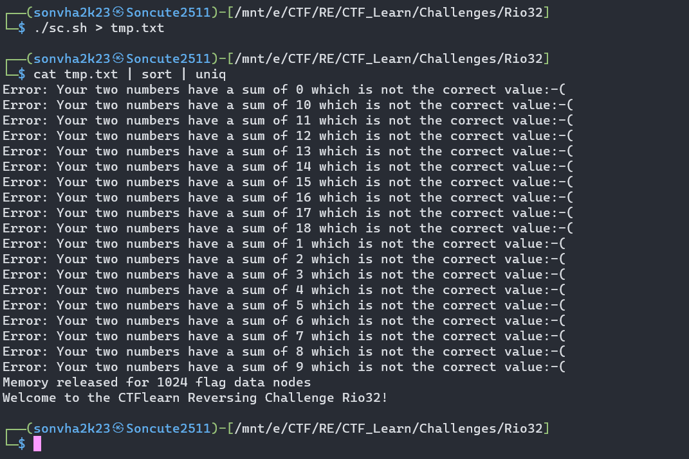

<style>
body {
    background-color: black;
    color: white;
}
</style>

## CTFlearn/RE

## Rio32

### Đề bài

https://ctflearn.com/challenge/download/1015

### Lời giải

- Tải file về và chạy thử, input bài này có vẻ khá lạ
  
- Với input đơn giản như này, trước khi phân tích ta thử vét cạn xem sao.

```bash script
#!/bin/bash
for i in {0..9}
do
    for j in {0..9}
    do
        ./Rio32 "$i $j"
    done
done
```



- Kết quả cũng không bất ngờ lắm, dù sao cũng là bài có độ khó medium :v
- Dù sao cũng là một manh mối, mình đoán rằng để lấy được flag thì cần set lại giá trị thanh ghi kiểm tra ở một vị trí nào đó. Dùng `IDA` và `GDB` để xem luồng chương trình ra sao.

- // bài này mình lười nên chưa viết nốt mn thông cảm :v

## Mong WRITEUP này giúp ích cho các bạn!

```
from KMA
Author: 13r_ə_Rɪst
Email: sonvha2k23@cvp.vn
```
