## CTFlearn/RE

## Rotterdam

### Đề bài

https://ctflearn.com/challenge/1076

### Lời giải

- Để làm tới bài này, có lẽ mọi người đã có kỹ năng nhất định trong việc phân tích mã máy nên mình sẽ không trình bày quá chi tiết.
- Thực thi chương trình với một vài input cơ bản. Có thể thấy input bài này chỉ bao gồm nội dung của flag mà không có cụm `CTFlearn{}`.

  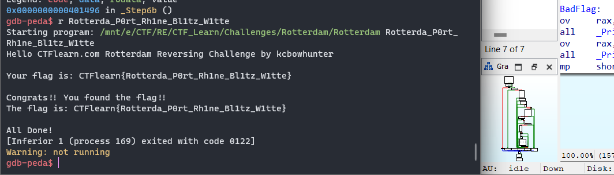

- Sử dụng đồng thời `GDB` và `IDA` để phân tích.

  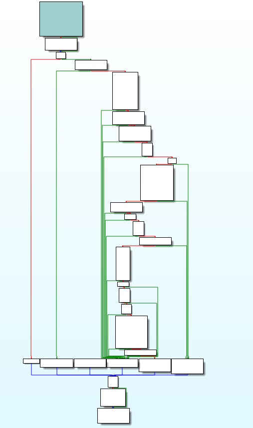

- Đánh giá sơ bộ, Challenge này qua graph view của IDA trông có vẻ phức tạp, đồng thời còn có nhiều thông báo gây nhiễu.

  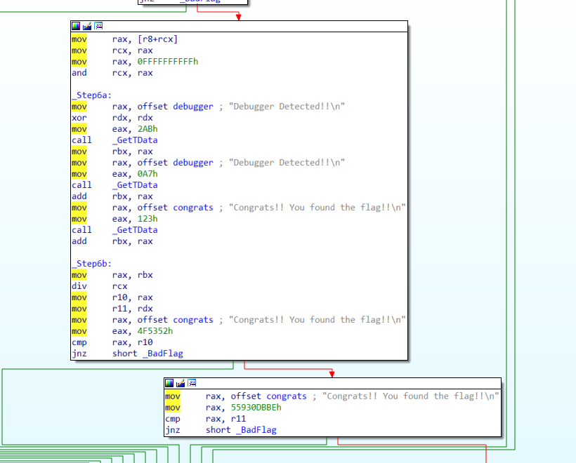

- Với input đầy đủ, Block đầu tiên chú ý tới là khối lệnh kiểm tra độ dài, lên tới 0x40 = 64.

  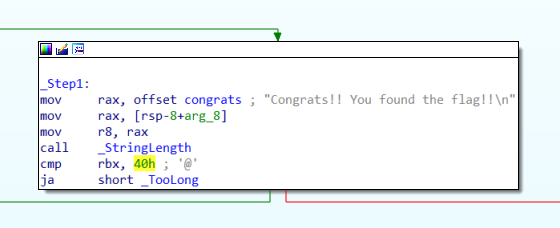

- Bỏ qua các thông báo gây nhiễu, tiếp tới là một loạt các hàm biến đổi giá trị.

  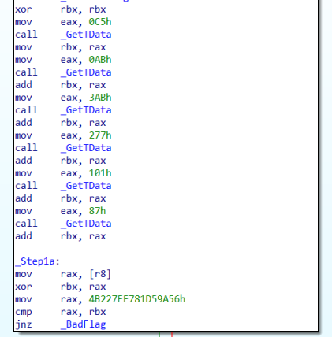

- Hàm `GetTData` có vẻ là hàm biến đổi giá trị, sau khi bấm vào xem nội dung của hàm, nội dung có vẻ rất dài nhưng đơn giản, dựa trên giá trị trong thanh ghi `EAX` mà cho ra output cụ thể. test thử bằng `GDB`, ta kết luận được rằng output của hàm `GetTData` không phụ thuộc vào kernel đầu vào mà chỉ phụ thuộc vào giá trị hiện tại ở thanh ghi `EAX`.

  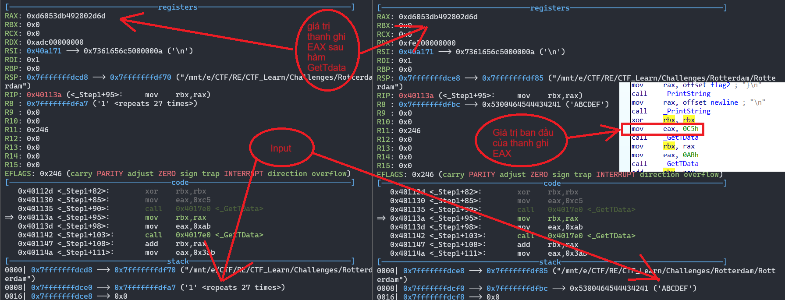

- Để dễ hình dung, mình có viết một đoạn chương trình nhỏ để mô tả hàm `GetTData` như sau:

```C++
    if(eax==A)
        eax = const1;
    else if(eax==B)
        eax = const2;
    ...
    return;
```

- Sau các câu lệnh gọi hàm `GetTData` và cộng dồn, giá trị được lưu tại `EBX = 0x1b773ca3c490c435` như hình.

  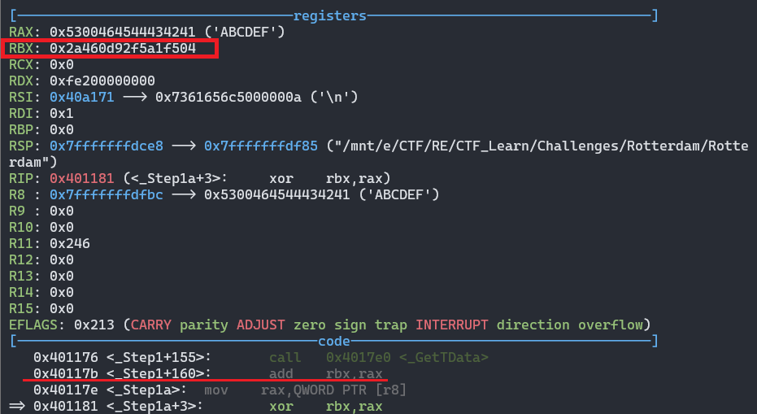

- Nhảy vào hàm `Step1a`, lệnh `mov RAX, [r8]` truyền vào thanh ghi `RAX` 7 kí tự đầu của input. Thực hiện phép `xor` với giá trị được tính toán ở `RBX` và so sánh với 0x4b227ff781d59a56. Phần đầu của flag sẽ được tính theo công thức:

```
0x1b773ca3c490c435 ^ X = 0x4b227ff781d59a56
-> X = 0x6164726574746f52
```

- X = 0x6164726574746f52 -> adrettoR. Giá trị được lưu trữ theo dạng little edian nên X = Rotterda.
- Khối sau đó theo thực hiện kiểm tra kí tự tiếp theo của input có tương đương với dấu '\_' hay không.

  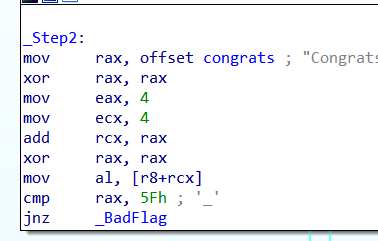

- Ở khối lệnh Step3, sau các phép biến đổi của hằng số, giá trị của `EAX` = 0xe2f2cef6, thực hiện tính tổng với 4 kí tự tiếp theo của input và so sánh với 0x15764ff46

  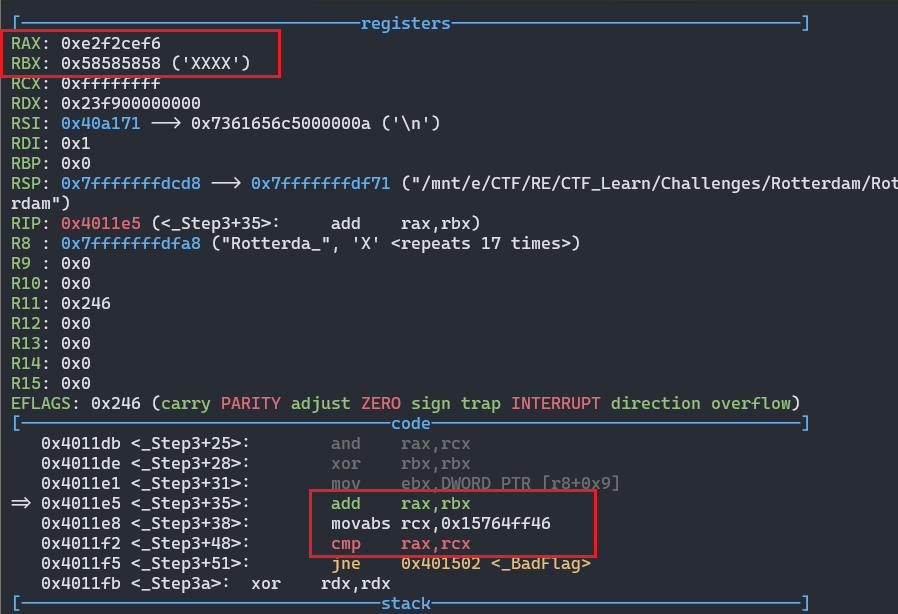

```
0xe2f2cef6 + X = 0x15764ff46
-> X = 0x74723050 = tr0P -> P0rt
```

- Như các hàm trước, các giá trị đều được tính toán và lưu vào `RBX` = 0x4d998c32ff, phần thứ 3 của flag được lưu vào `RCX`, gồm 5 kí tự.

```
X - 0x4d998c32ff = 0x17d4a53553
-> X = 0x656e316852 = en1hR -> Rh1ne
```

- Ở block `Step5`, có câu lệnh `mul RBX` là đáng chú ý, phép nhân giữa `RBX` và `RAX`, giá trị trong thanh ghi `RBX` = 0xdeb4fa4d998c32ff, khi thực hiện phép nhân, phần bit thấp lưu tại EAX(64bit sau), phần bit cao nằm ở EDX(64 bit đầu).

  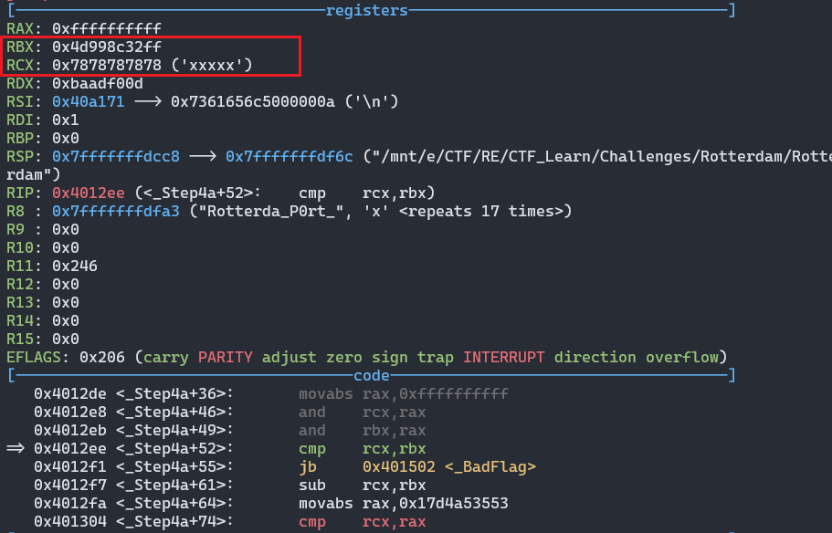

- Cụ thể, trong trường hợp này, phép nhân giữa `RAX` = 0x5858585858 ('XXXXX') và `RBX` = 0xdeb4fa4d998c32ff có kết quả chia làm 2 phần nằm ở `RAX` và `RDX`. Giá trị trong `RAX` = 0x43e738d629612fa8 và `RDX` = 0x4cdb111bc8.

```
- 0x43e738d629612fa8 = 01000011 11100111 00111000 11010110 00101001 01100001 00101111 10101000
- 0x4cdb111bc8 = 01001100 11011011 00010001 00011011 11001000
-> 0xdeb4fa4d998c32ff * 0x5858585858 = (01001100 11011011 00010001 00011011 11001000) (01000011 11100111 00111000 11010110 00101001 01100001 00101111 10101000) = 0x4cdb111bc843e738d629612fa8
```

- Dựa vào ví dụ nêu trên, phân tích hai phép kiểm tra giữa r10 và 0x37f7d400a77b9be, r11 và 0x6a87544938.

  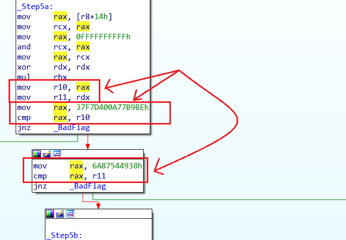

- Với r10 là phần bit thấp của phép nhân, r11 chứa phần bit cao của phép nhân. Lệnh kiểm tra sẽ trả về `true` nếu:

```
r10 = 0x37f7d400a77b9be = 00000011 01111111 01111101 01000000 00001010 01110111 10111001 10111110
r11 = 0x6a87544938 = 00000000 01101010 10000111 01010100 01001001 00111000
-> RBX * X = 0xdeb4fa4d998c32ff * X = 01101010 10000111 01010100 01001001 00111000 00000011 01111111 01111101 01000000 00001010 01110111 10111001 10111110 = 0x6a87544938037f7d400a77b9be
-> X = 0x6a87544938037f7d400a77b9be/0xdeb4fa4d998c32ff = 0x7A74316C42 = zt1lB -> Bl1tz
```

- Khối lệnh Step6 thực hiện kiểm tra kết quả phép chia, tách làm 2 phần là phần nguyên và phần dư.

  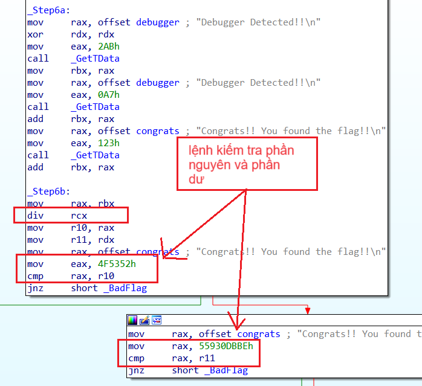

- Gần tương tự phép nhân, phần kết quả nguyên của phép chia được lưu vào `RAX`, còn phần dư được lưu vào `RDX`. 2 câu lệnh kiểm tra sẽ trả về true nếu:

```
r10 = `RAX`/`RCX` = 0x1f6ff5218c40de9c / X = 0x4f5352
r11 = `RAX`%`RCX` = 0x1f6ff5218c40de9c % X = 0x55930dbbe
-> X = (0x1f6ff5218c40de9c - 0x55930dbbe)/0x4f5352 = ett1W -> W1tte
```

- Tới đây chương trình đã kết thúc, ta tổng hợp lại các đoạn flag thu thập được và ghép lại chạy thử.

  

```
flag: CTFlearn{Rotterda_P0rt_Rh1ne_Bl1tz_W1tte}
```

## Mong WRITEUP này giúp ích cho các bạn :v

```
from KMA
Author: 13r_ə_Rɪst
Email: sonvha2k23@cvp.vn
```
