## CTFlearn/RE

## Rzerzow

### Đề bài

https://ctflearn.com/challenge/download/1003

### Lời giải

- Sau khi tải file thực thi về, ta chạy thử để xem chương trình hoạt động ra sao.

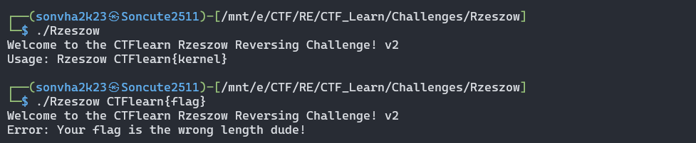

- Ta thấy bài này có cơ chế không khác những bài trước là bao. Kiểm tra xem file Rzerzow là `64bit` hay `32bit` và chạy IDA bản tương ứng, ở đây là `64bit`

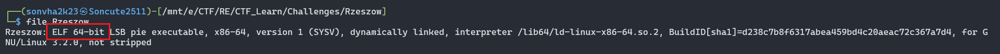

- Khi quan sát qua, có thể khẳng định độ dài của flag là 20 kí tự

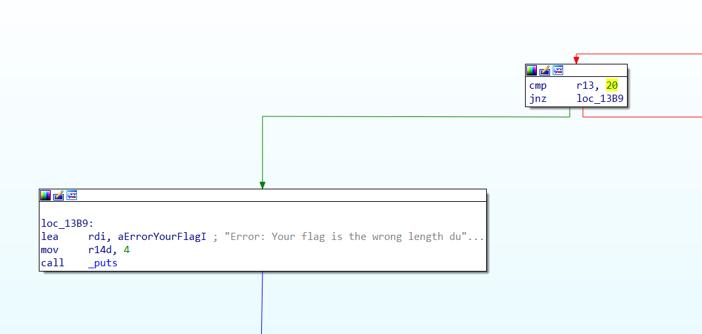

- Thử nghiệm với đầu vào đúng format CTFlearn{} và 10 kí tự nội dung, chương trình đã hiển thị như sau

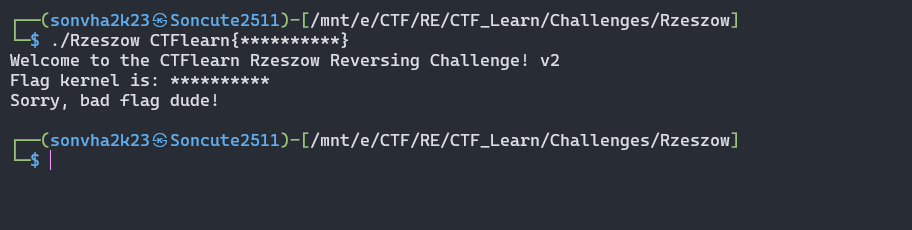

- Sau khi đảm bảo được format của flag, ta xem hàm kiểm tra thì thấy rằng có tới 2 đường đi đều dẫn đến flag, 1 hàm kiểm tra tuần tự với 10 hàm biến đổi, 1 hàm dùng vòng lặp.

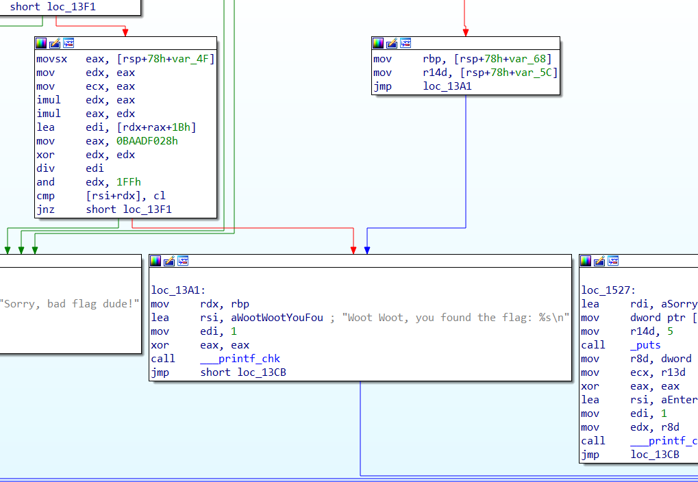
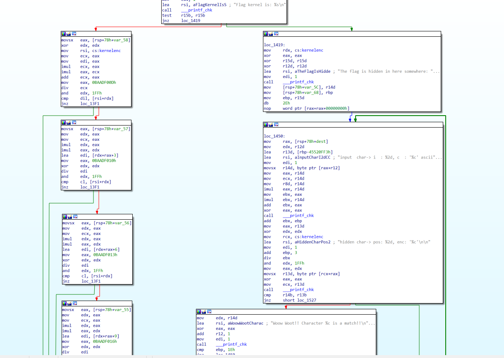

- Dù nhìn qua 2 bên không khác nhau là mấy, ta sử dụng `GDB` để kiểm tra xem chương trình sẽ nhảy vào bên nào để kiểm tra rồi viết code khai thác dựa trên hàm đó xem sao.

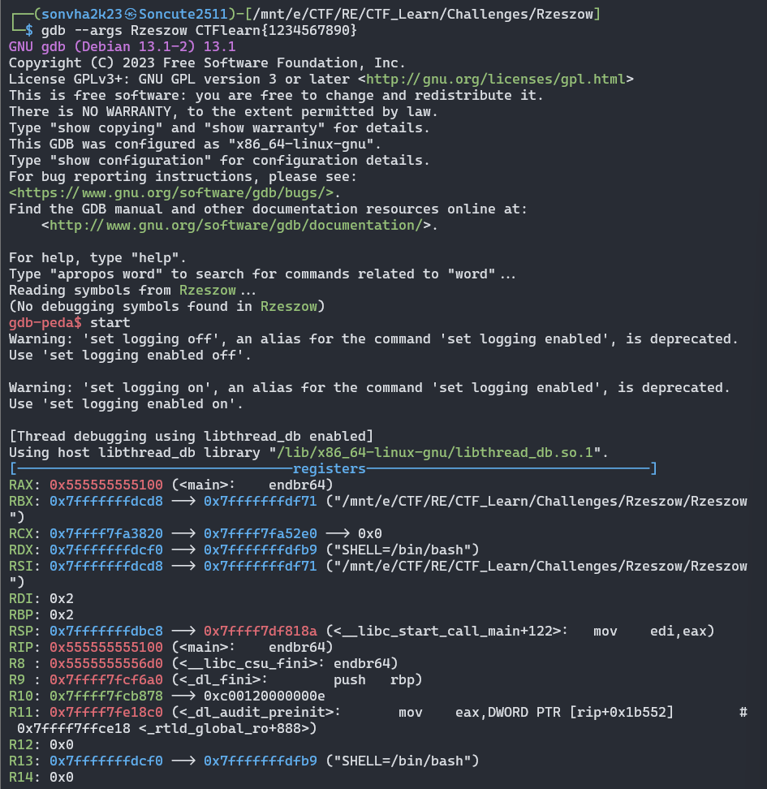

- Dùng lệnh `ni` cho tới điểm cần kiểm tra. Như đã thấy, chương trình không thực hiện nhảy, vậy bài toán của ta ở đây là if/else đến chết :v

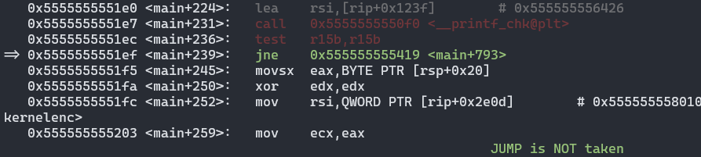

- Ở khối lệnh kiểm tra đầu tiên, ta có thể phân tích mã asm như sau:

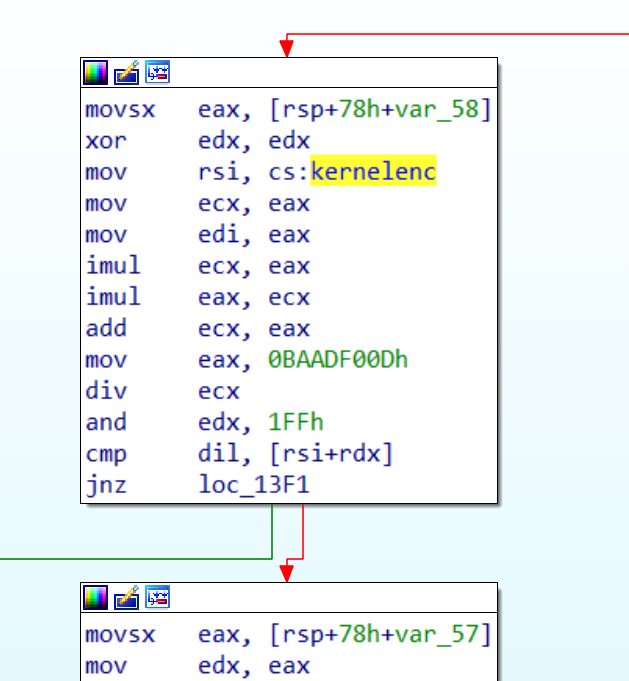

- Đưa giá trị đầu tiên trong flag mà ta nhập vào thanh ghi EAX, ở đây cụ thể là `0x31`( tương ứng với kí tự '1' trong bảng mã `ASCII` với flag đầu vào là "CTFlean{1234567890}")
- Đưa một đoạn chuỗi vào thanh ghi `RSI`, dùng lệnh để lấy ra xem thử, khả năng cao là key, chép lại đã.

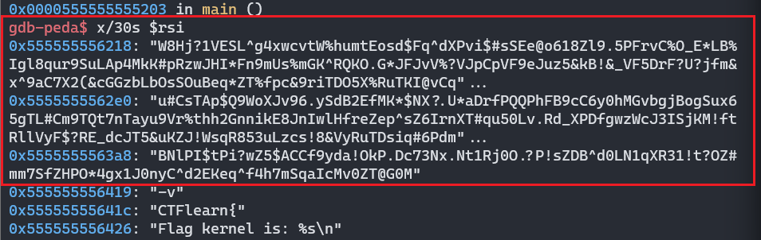

- 4 dòng lệnh tiếp theo thực hiện một vài phép toán. Truyền giá trị hiện tại ở thanh ghi `EAX`(0x31) vào `ECX`, làm điều tương tự với `EDI`. Lệnh `imul ECX, EAX` thực hiện phép nhân của giá trị nằm trong 2 thanh ghi rồi lưu vào `ECX`. Khi đó, giá trị ở thanh ghi `ECX` = 0x31<sup>2</sup>. Tiếp theo, lệnh `imul EAX, ECX` trả về giá trị thanh ghi `EAX` = 0x31\*0x31<sup>2</sup> = 0x31<sup>3</sup>. Cộng giá trị ở 2 thanh ghi rồi lưu vào `ECX` với lệnh `add ECX, EAX`, giá trị hiện tại ở `ECX` là = 0x31<sup>2</sup>+0x31<sup>3</sup>. Lệnh `div ECX` với giá trị được truyền vào thanh ghi `EAX` trước đó là `0xbaadf00d`, giá trị phần dư được lưu vào thanh ghi `EDX`. Lệnh `and EDX, 0x1FF` đơn thuần là thực hiện phép `&`. Cuối cùng so sánh giá trị đầu vào của ta với giá trị nằm ở thanh ghi `RSI` với `RDX` đơn vị thông qua câu lệnh `cmp dil, BYTE PTR [rsi+rdx]`.
- Từ phân tích trên, ta viết thử một đoạn mã khai thác để kiểm tra trường hợp thứ nhất như sau:

```python

flag_comp = 'abcdefghijklmnopqrstuvwxyzABCDEFGHIJKLMNOPQRSTUVWXYZ0123456789!@#$%^&*()_+-=<>,.?/{}[]\|~'
kernelenc = "W8Hj?1VESL^g4xwcvtW%humtEosd$Fq^dXPvi$#sSEe@o618Zl9.5PFrvC%O_E*LB%Igl8qur9SuLAp4MkK#pRzwJHI*Fn9mUs%mGK^RQKO.G*JFJvV%?VJpCpVF9eJuz5&kB!&_VF5DrF?U?jfm&x^9aC7X2(&cGGzbLbOsSOuBeq*ZT%fpc&9riTDO5X%RuTKI@vCqu#CsTAp$Q9WoXJv96.ySdB2EfMK*$NX?.U*aDrfPQQPhFB9cC6y0hMGvbgjBogSux65gTL#Cm9TQt7nTayu9Vr%thh2GnnikE8JnIwlHfreZep^sZ6IrnXT#qu50Lv.Rd_XPDfgwzWcJ3ISjKM!ftRllVyF$?RE_dcJT5&uKZJ!WsqR853uLzcs!8&VyRuTDsiq#6PdmBNlPI$tPi?wZ5$ACCf9yda!OkP.Dc73Nx.Nt1Rj0O.?P!sZDB^d0LN1qXR31!t?OZ#mm7SfZHPO*4gx1J0nyC^d2EKeq^f4h7mSqaIcMv0ZT@G0M"
flag = ''

for i in flag_comp:
    v21 = ord(i)
    if i == kernelenc[(0xBAADF00D % (v21 * v21 * v21 + v21 * v21)) & 0x1FF]:
        flag += i
print(flag)
```

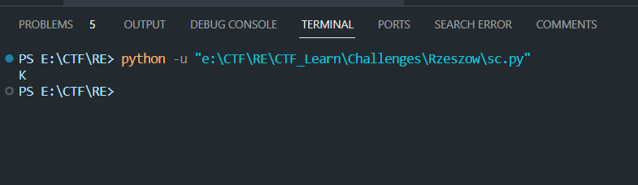

Đừng để ý 5 problem :v, quan trọng hơn là ta đã có giá trị 'K' sau khi thực hiện tương tự các phép biến đổi của khối lệnh kiểm tra. set lại giá trị đầu tiên của input thành 'K' để check xem công thức đã đúng hay chưa.

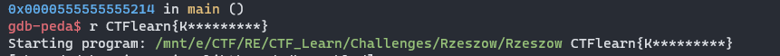
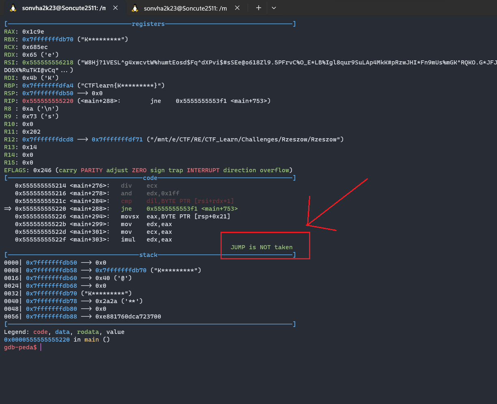

- JUMP is NOT taken, tức là kí tự đầu tiên đã chính xác bởi nếu câu lệnh `jne`(jump not equal) được thực hiện, thì đây sẽ là khối lệnh nó tìm đến :v

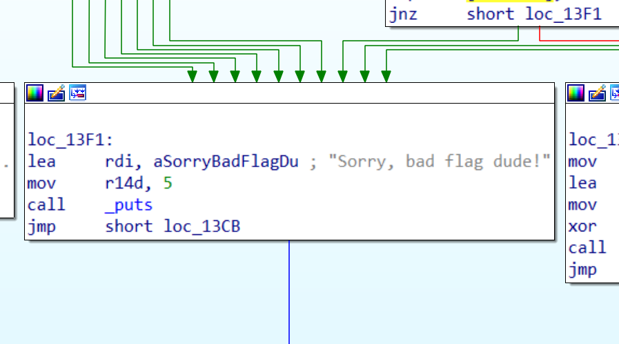

- Phân tích và làm điều tương tự với các khối lệnh kiểm tra khác, ta có chương trình python sau:

```python
for i in flag_comp:
    v21 = ord(i)
    if i == kernelenc[(0xBAADF00D % (v21 * v21 * v21 + v21 * v21)) & 0x1FF]:
        flag += i
for i in flag_comp:
    v21 = ord(i)
    if i == kernelenc[(0xBAADF010 % (v21 * v21 + v21 * v21 * v21 + 3)) & 0x1FF]:
        flag += i
for i in flag_comp:
    v21 = ord(i)
    if i == kernelenc[(0xBAADF013 % (v21 * v21 + v21 * v21 * v21 + 6)) & 0x1FF]:
        flag += i
for i in flag_comp:
    v21 = ord(i)
    if i == kernelenc[(0xBAADF016 % (v21 * v21 + v21 * v21 * v21 + 9)) & 0x1FF]:
        flag += i
for i in flag_comp:
    v21 = ord(i)
    if i == kernelenc[(0xBAADF019 % (v21 * v21 + v21 * v21 * v21 + 12)) & 0x1FF]:
        flag += i
for i in flag_comp:
    v21 = ord(i)
    if i == kernelenc[(0xBAADF01C % (v21 * v21 + v21 * v21 * v21 + 15)) & 0x1FF]:
        flag += i
for i in flag_comp:
    v21 = ord(i)
    if i == kernelenc[(0xBAADF01F % (v21 * v21 + v21 * v21 * v21 + 18)) & 0x1FF]:
        flag += i
for i in flag_comp:
    v21 = ord(i)
    if i == kernelenc[(0xBAADF022 % (v21 * v21 + v21 * v21 * v21 + 21)) & 0x1FF]:
        flag += i
for i in flag_comp:
    v21 = ord(i)
    if i == kernelenc[(0xBAADF025 % (v21 * v21 + v21 * v21 * v21 + 24)) & 0x1FF]:
        flag += i
for i in flag_comp:
    v21 = ord(i)
    if i == kernelenc[(0xBAADF028 % (v21 * v21 + v21 * v21 * v21 + 27)) & 0x1FF]:
        flag += i
print(flag)
```

thực thi chương trình, ta thu được flag.
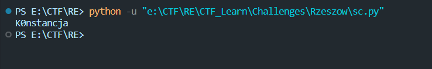

```
flag: CTFlearn{K0nstancja}
```

- Như nhận định ban đầu, ta còn một khối lệnh nữa cũng dẫn đến block `Woot Woot, you found the flag`, phân tích và viết lại bằng python, trông có vẻ gọn gàng hơn trường hợp trước đó với 8 cái if @@.

```python
j = 0
while j < 30:
    for i in flag_comp:
        v12 = j
        tmp = ord(i)
        v12 += pow(tmp, 2)+pow(tmp, 3)
        v12 = (0xbaadf00d+j) % v12
        v12 = v12 & 0x1ff
        if i == kernelenc[v12]:
            flag += i
    j += 3
print(flag)
```

- Tinh gọn code cho dễ nhìn

```python
j = 0
while j < 30:
    for i in flag_comp:
        v12 = j
        tmp = ord(i)
        if i == kernelenc[((0xbaadf00d+j) % (v12+pow(tmp, 2)+pow(tmp, 3))) & 0x1ff]:
            flag += i
    j += 3
print(flag)
```

## Mong WRITEUP này giúp ích cho các bạn!

```
from KMA
Author: 13r_ə_Rɪst
```
